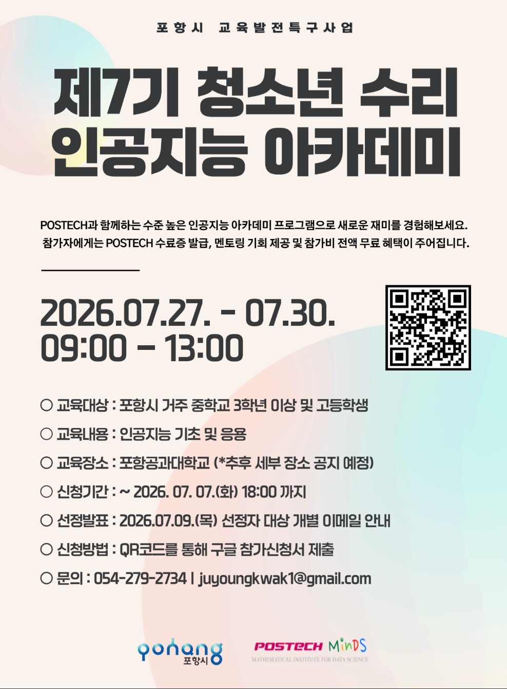

# 7회 포스텍청소년수리인공지능아카데미

## 강의 개요
**포항시** 가 주최하고 **포항공과대학교 수리데이터과학 연구소(POSTECH MINDS)** 가 위탁 운영하는 고등학생 대상 인공지능 교육 프로그램입니다. 인공지능의 기본 원리부터 실습 기반의 데이터 분석 및 모델 구축 경험을 제공하여, 지역 인재들이 미래 기술 역량을 갖출 수 있도록 돕습니다.  

|**주최**| 포항시|
|---|---|
|**운영**| 포항공과대학교 수리데이터과학 연구소|
|**대상**| 포항시 관내 고등학생  
|**기간**| 2026.07.27 ~ 2026.07.30 (총 4일/3시간)|  
|**장소**| 포항공과대학교 수리과학관 1층 강의실|

| 분반 | 인원 | 장소 | 조교 이름 |
| :--- | :---: | :---: | :--- |
| 중 3A 튜링 반 | 4명 | 208호 | 이동진, 김병규 |
| 중 3B 오일러 반 | 4명 | 213호 | 이지호, 이성헌 |
| 고 1A 가우스 반 | 6명 | 100호 | 박해룡, 염시진 |
| 고 1B 뉴튼 반 | 6명 | 104호 | 최지훈, 한승완 |
| 고 2C 장영실 반 | 7명 | 404호 | 임재형, 김우주 |

## 운영진 소개
| 담당 |이름|소속| 연락처 |
|---|---|---|---|
|교육 책임|정재훈 교수님|수학과|jung153@postech.ac.kr|
|행정 및 운영|곽주영 선생님|수학과|juyoungkwak0@postech.ac.kr|
|강사|이지호|인공지능대학원|jihlee@postech.ac.kr|
|강사|염시진|인공지능대학원|yeomsijin@postech.ac.kr|
|강사|박해룡|물리학과|phrphr@postech.ac.kr|
|강사|임재형|인공지능대학원|jaehyunglim@postech.ac.kr|
|강사|김병규|컴퓨터공학과|qudrb6989@postech.ac.kr|
|강사|한승완|수학과|han97@postech.ac.kr|
|강사|이정민|인공지능대학원|jungmin.lee@postech.ac.kr|
|강사|전병연|인공지능대학원|byungyunjeon@postech.ac.kr|

## 강의 계획

| 날짜 | 차시 | 강사 | 강의 내용 | 강의 자료 |
| :--- | :--- | :--- | :--- | :--- |
| [Day 1] 2026.07.27 | 1차 | 염시진 | [이론] 함수로 설명하는 인공지능 개론 | |
| | 2차 | 김병규 | [이론] 선형회귀 | |
| | 3/4차 | | [실습] 파이썬 기초 / 선형회귀 / 로지스틱회귀| [link](DAY1_PYMAIA7.ipynb)|
| [Day 2] 2026.07.28 | 1차 | 임재형 | [이론] MLP - 기본 | |
| | 2차 | 한승환 | [이론] MLP 수학 - 미분, 최적화, 행렬 | |
| | 3/4차 | | [실습] 인공지능 수학 / 최적화 / SLP| [link](DAY2_PYMAIA7.ipynb)|
| [Day 3] 2026.07.29 | 1차 | 김우주 | [이론] 심층인공신경망이론 | |
| | 2차 | 박해룡 | [이론] CNN 기초 | |
| | 3/4차 | | [실습] MLP / SLP| [link](DAY1_PYMAIA7.ipynb)|
| [Day 4] 2026.07.30 | 1차 | 이동진 | [실습] 프로젝트 문제 설명 | |
| | 2/3차 | | [실습] 프로젝트 발표 및 test | |
| | 4차 | | [실습] 프로젝트 수상 및 수료증 | |
## 관련 링크
[강사구글닥스](https://docs.google.com/document/d/1F0pm9ecaNMEE4v_u0v-alpU5aY_50KT9NqsoEhwu6fU/edit?tab=t.0)  
  
[Repository]   
[6기 1반](https://github.com/HiddenBeginner/The-6th-POSTECH-Youth-Mathematical-Artificial-Intelligence-Academy-Class1)/[2반](https://github.com/MINDS-edu/The-6th-POSTECH-Youth-Mathematical-Artificial-Intelligence-Academy-Class2)  
[5기](https://github.com/MINDS-edu/The-5th-POSTECH-Youth-Mathematical-Artificial-Intelligence-Academy)  
[4기](https://github.com/MINDS-edu/The-4th-POSTECH-Youth-Mathematical-Artificial-Intelligence-Academy-Public)  
[3기](https://github.com/MINDS-edu/The-3rd-POSTECH-Youth-Mathematical-Artificial-Intelligence-Academy)  
[2기](https://github.com/MINDS-edu/2024_teenager_Math_AI_Acadmy)  

